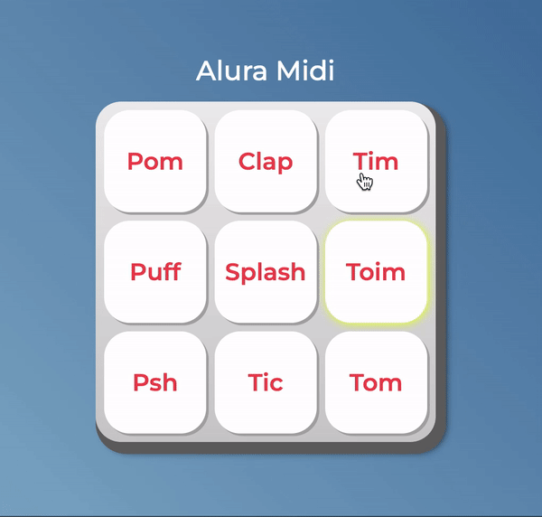

<div align="center" justify-content="space-between">
   
  <h1>Alura Midi <br/> 
  Tocador de som</h1>
</div>

<h3 align="center">  
  <p align="center">
    <a href="#-sobre">Sobre</a>&nbsp;&nbsp;&nbsp;|&nbsp;&nbsp;&nbsp;
    <a href="#-tecnologias">Tecnologias</a>&nbsp;&nbsp;&nbsp;|&nbsp;&nbsp;&nbsp;
    <a href="#-como-executar">Como Executar</a>&nbsp;&nbsp;&nbsp;|&nbsp;&nbsp;&nbsp;
    <a href="#-licença">Licença</a>
  </p>
</h3>

<div align="center">
     
</div>

## 📚 Sobre

O projeto é um **tocador de som** que foi desenvolvido com javascript puro. O objetivo foi a prática das condições e lógicas de programação usando somente essa linguagem.

Além da funcionalidade pelo mouse, foi desenvolvido também a navegação via teclado, para a acessibilidade e usabilidade do usuário.

## 🚀 Tecnologias utilizadas

- [Javascript](https://developer.mozilla.org/pt-BR/docs/Web/JavaScript)
- [Css](https://developer.mozilla.org/pt-BR/docs/Web/CSS)
- [DevTools](https://developer.mozilla.org/en-US/docs/Learn_web_development/Howto/Tools_and_setup/What_are_browser_developer_tools) do navegador (práticas e testes)

## ⏱️ Como executar

```bash
# Clonar o repositório
$ git clone https://github.com/polyanetuag/aluramidi.git

# Entrar na pasta  
$ cd aluramidi
```
*Obs*: Para rodar o projeto, foi utilizada a extensão live-server do VsCode, mas pode ser utilizado qualquer outra extensão ou servidor local.
## 📝 Licença

Esse projeto está sob a licença [MIT](https://opensource.org/license/mit).

---
Desenvolvido com 💜 por Polyane Tuag
